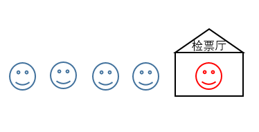
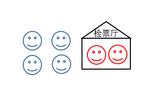

> 生吞并发和多线程编程前， 先搞清楚最基础的概念： “串行， 并行， 并发， 进程， 线程”这些是什么？ 有什么区别？

其实这五个概念不应该在一块儿来进行比较, 如果非要说有什么联系的话, 那么我是这么理解的: <u>首先把进程当作一个对象, 那么"串行, 并行, 并发"则是形容这个对象的能力, 而线程则是实现这些能力的方式.</u>

**以火车站检票为例, 其中对象包含检票厅和检票人和4位待检票人.** 

**这里规定一下, 检查完4人的票就是检票厅的任务, 也就是任务粒度为4人.**

## **串行**

4位待检票人只能依次检票, 前一个检票完成后, 下一个才能开始检票

## **并行**

检票厅新增了一名检票人员, 4位待检票人能够分为两拨进行检票(但是还是4个人哦, 也就是说还是一个任务)

## **并发**

又来了四位检票人, 这4人跟之前的4人优先级一样, 那么现在是8人, 也就是2个任务, 在这种情况下不计较检票厅中有多少检票人员

上面是一个简单的拟物描述, 下面引用stackoverflow上前辈说的话

> Concurrency is when two tasks can start, run, and complete in overlapping time periods. Parallelism is when tasks literally run at the same time, eg. on a multi-core processor.
> Concurrency is the composition of independently executing processes, while parallelism is the simultaneous execution of (possibly related) computations.
> Concurrency is about dealing with lots of things at once. Parallelism is about doing lots of things at once.
> An application can be concurrent – but not parallel, which means that it processes more than one task at the same time, but no two tasks are executing at same time instant.
> An application can be parallel – but not concurrent, which means that it processes multiple sub-tasks of a task in multi-core CPU at same time.
> An application can be neither parallel – nor concurrent, which means that it processes all tasks one at a time, sequentially.
> An application can be both parallel – and concurrent, which means that it processes multiple tasks concurrently in multi-core CPU at same time.
> Vipin Jain. [Differences between concurrency vs. parallelism](https://stackoverflow.com/questions/4844637/what-is-the-difference-between-concurrency-parallelism-and-asynchronous-methods)
>
> > 并发是两个任务可以在重叠的时间段内启动，运行和完成。并行是任务在同一时间运行，例如，在多核处理器上
> > 并发是独立执行过程的组合，而并行是同时执行（可能相关的）计算
> > 并发是一次处理很多事情，并行是同时做很多事情
> > 应用程序可以是并发的，但不是并行的，这意味着它可以同时处理多个任务，但是没有两个任务在同一时刻执行
> > 应用程序可以是并行的，但不是并发的，这意味着它同时处理多核CPU中的任务的多个子任务
> > 一个应用程序可以即不是并行的，也不是并发的，这意味着它一次一个地处理所有任务
> > 应用程序可以即是并行的也是并发的，这意味着它同时在多核CPU中同时处理多个任务

简单点理解就是:

> 并发的关键是你有处理多个任务的能力，不一定要同时
> 并行的关键是你有同时处理多个任务的能力

关键点在于『**是否同时**』

## **进程**

> 进程（Process）是计算机中的程序关于某数据集合上的一次运行活动，是系统进行资源分配和调度的基本单位，是[操作系统](https://baike.baidu.com/item/操作系统)结构的基础。在早期面向进程设计的计算机结构中，进程是程序的基本执行实体；在当代面向线程设计的计算机结构中，进程是线程的容器。程序是指令、数据及其组织形式的描述，进程是程序的实体。

可以理解为上述例子中的检票厅就是一个进程

一个java程序启动后就是一个进程, 但是进程就相当于一个空壳, 只提供资源装载的空间, 具体的计算和调度是由线程来完成的. 

比如, 一个java程序通过main方法进行启动, 也就是进程启动, 而同时也会起一条线程(主线程)来进行计算和调度

## **线程**

> 线程是[操作系统](https://baike.baidu.com/item/操作系统)能够进行运算[调度](https://baike.baidu.com/item/调度)的最小单位。它被包含在[进程](https://baike.baidu.com/item/进程)之中，是[进程](https://baike.baidu.com/item/进程)中的实际运作单位。

进程与线程相辅相成, 线程包含在进程之中, 进程中至少有一条线程

可以理解为上述例子中的检票厅中的检票员就是一条线程, 检票员离开检票厅的话别人也不会让你去检票, 因为只有检票厅中有检票需要的设备, 检票厅失去了检票员也不再具备检票的能力了(不要杠机器自动化), 存在也没有意义.

**守护线程**

守护线程也是线程, 只是作用比较特殊, 是在程序运行的时候在后台提供一种通用服务的线程, 它独立于控制终端并且周期性地执行某种任务或等待处理某些发生的事件。在 Java 中垃圾回收线程就是特殊的守护线程.

在JVM中如果用户线程(普通线程)已经全部退出运行了，只剩下守护线程存在了，虚拟机也就退出了.

## **面试题**

**并行与并发什么区别**

并行：多个处理器或多核处理器同时处理多个任务。

并发：多个任务在同一个 CPU 核上，按细分的时间片轮流(交替)执行，从逻辑上来看那些任务是同时执行。

**进程与线程的区别**

进程是资源分配的最小单位，线程是程序执行的最小单位。

一个程序下至少有一个进程，一个进程下至少有一个线程，一个进程下也可以有多个线程来增加程序的执行速度