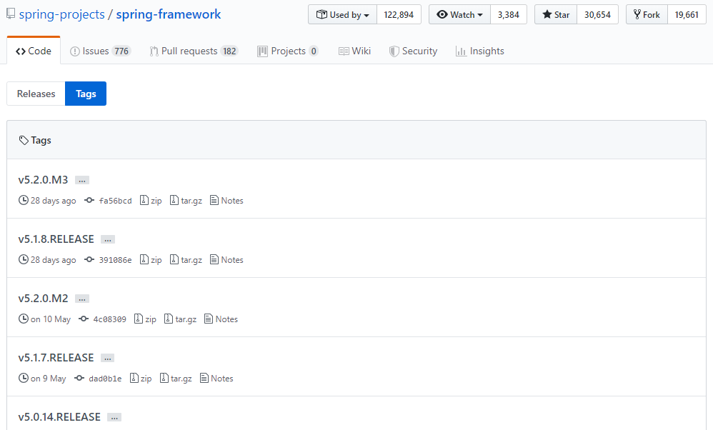
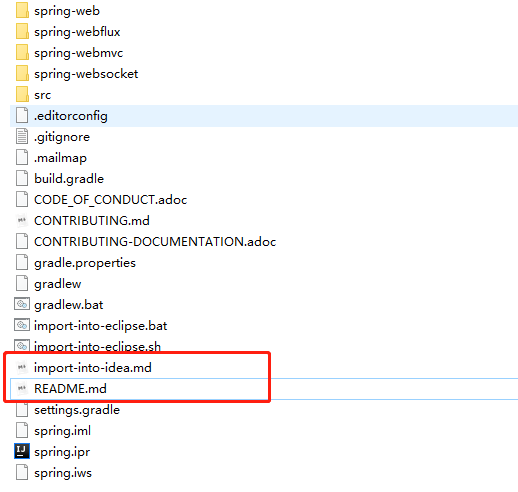
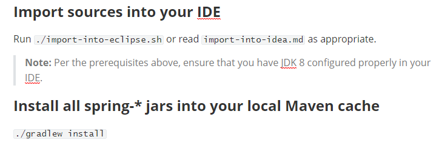
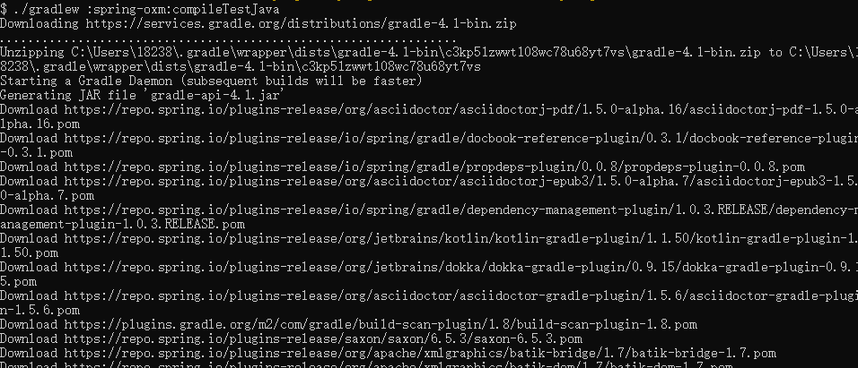
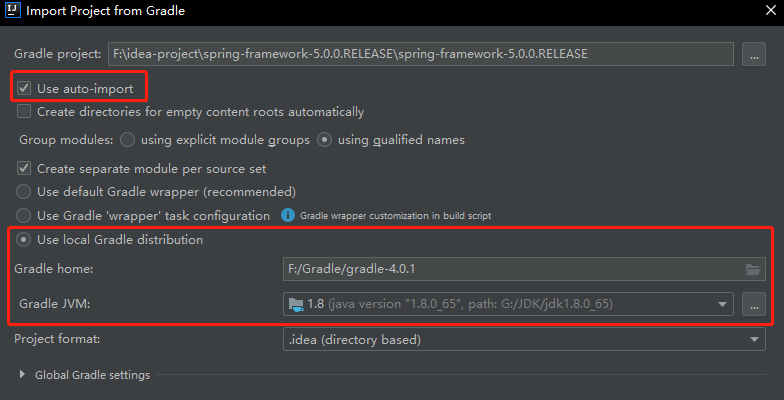
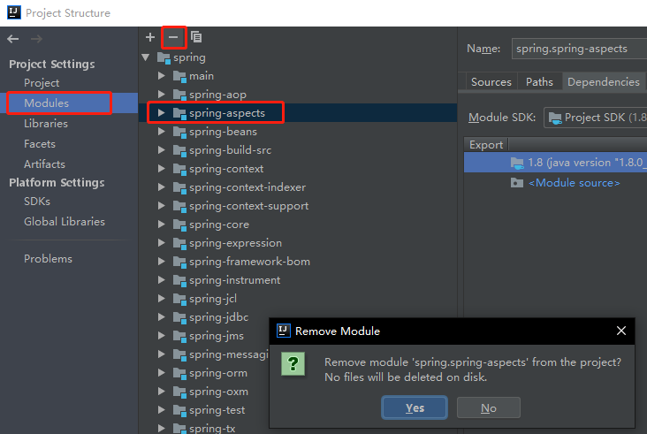

# 准备项

- JDK 8 update 20或更高版本

- IntelliJ IDEA

   (我的版本2019.1.3-U [IDEA 2017.1版本会有问题, 后续会说] ) 

- gradle (我的版本4.0.1)

# 下载源码

网上很多说使用git通过git clone来去下载源码, 其实大可不必, 直接上github上下载源码包即可, 下载地址: https://github.com/spring-projects/spring-framework/tags, 下载zip包

我下载的是5.0.0.RELEASE版本.

# 构建

下载完成后, 将下载的zip包拷贝到你的工作目录并解压, 打开解压后的文件夹, 将看到如下

首先查看README.md文件, 这个文件一般会是对项目的说明和引导

> **将源代码导入你的IDE**
> 根据需要 运行'./ import-into-eclipse.sh' 或 读取'import-into-idea.md'。
>
> > **注意：**确保在IDE中正确配置了JDK 8
>
> **将所有Spring的jar安装到本地Maven缓存**
> 执行 ./gradlew build指令

我选用的IDE是IDEA, 那么根据文档提示, 首先需要阅读import-into-idea.md, 在上面截图中

我也标注了出来.

> **导入步骤**
>
> 首先移步到spring-framewock的工作目录(也就是import-into-idea.md所在目录)
>
> 1. 执行./gradlew :spring-oxm:compileTestJava命令对spring-oxm进行预编译(这里是因为打包的依赖关系)
> 2. 导入IDEA (File -> New -> Project from Existing Sources -> Navigate to directory -> Select build.gradle)
> 3. 导入过程中, 有提示时应排除'spring-aspects'模块 或者 在导入成功后通过File-> Project Structure -> Modules来排除

那按照他的步骤来呗. 

在当前目录打开命令行, 执行./gradlew :spring-oxm:compileTestJava (这里要保证你的Gradle安装正确, 可以使用gradle -version进行测试)

过程比较耗时, 等待结束了以后打开IDEA, 通过File -> New -> Project from Existing Sources -> Navigate to directory -> Select build.gradle进行导入

然后在打开窗口选择spring-framework文件夹下的build.gradle文件, 然后在<a name="GradleConfig">Gradle配置页面</a>注意

记得勾选Use auto-import选项, 将Gradle的路径和java配置完善

导入成功后, 记得排除spring-aspects模块

至此, 项目算是导入成功了, 正常情况下IDE会自动下载项目声明的依赖包, 如果没有的话, 可以通过快捷键Ctrl+Shift+A调出搜索窗口, 在窗口中键入Refresh all Gradle projects, 点击匹配项进行Gradle的刷新.  或者也可以在工作目录调出命令窗口, 执行README.md中提示的指令./gradlew build, 这样同样也会下载相应的依赖

# 遇到的问题

**Gradle在下载依赖期间出现如下错误**

> FAILURE: Build failed with an exception.
> * What went wrong:
> A problem occurred configuring root project 'spring'.
> Could not resolve all dependencies for configuration ':classpath'.
> Could not resolve org.springframework.build.gradle:propdeps-plugin:0.0.7.
>      Required by:
>          :spring:4.2.3.BUILD-SNAPSHOT
>       > Could not resolve org.springframework.build.gradle:propdeps-plugin:0.0.7.
>          > Could not get resource 'https://repo.spring.io/plugins-release/org/springframework/build/gradle/propdeps-plugin/0.0.7/propdeps-plugin-0.0.7.pom'.
>             > Could not GET 'https://repo.spring.io/plugins-release/org/springframework/build/gradle/propdeps-plugin/0.0.7/propdeps-plugin-0.0.7.pom'.
>                > Connect to repo.spring.io:443 [repo.spring.io/35.186.232.213] failed: Connection timed out: connect
> * Try:
> Run with --stacktrace option to get the stack trace. Run with --info or --debug option to get more log output.

不用注意细节, 就类似这种**在某个网络地址下找不到某个文件**的问题, 解决方案是在build.gradle文件中repositories节点下面增加[maven{url "http://repo.springsource.org/plugins-release"}]仓库就好了

**运行测试: Error:Unable to make the module: \*\*\*\*, related gradle configuration was not found. Please, re-import the Gradle project and try again.**

出现这种问题的可能性有两种:

1. <a href="#GradleConfig">Gradle配置页面</a>配置不正确, 那么就需要打开settings配置页 --> Build, Execution, Dployment --> Build Toos --> Gradle配置页面照上述重新配置
2. 我一开始尝试用idea 2017版本去构建, 然后卡在这个错误里了, 后来在GitHub上的某个问题中找到了[解答](https://github.com/edvin/tornadofx-idea-plugin/issues/15), 我的解决方案就是升级idea版本